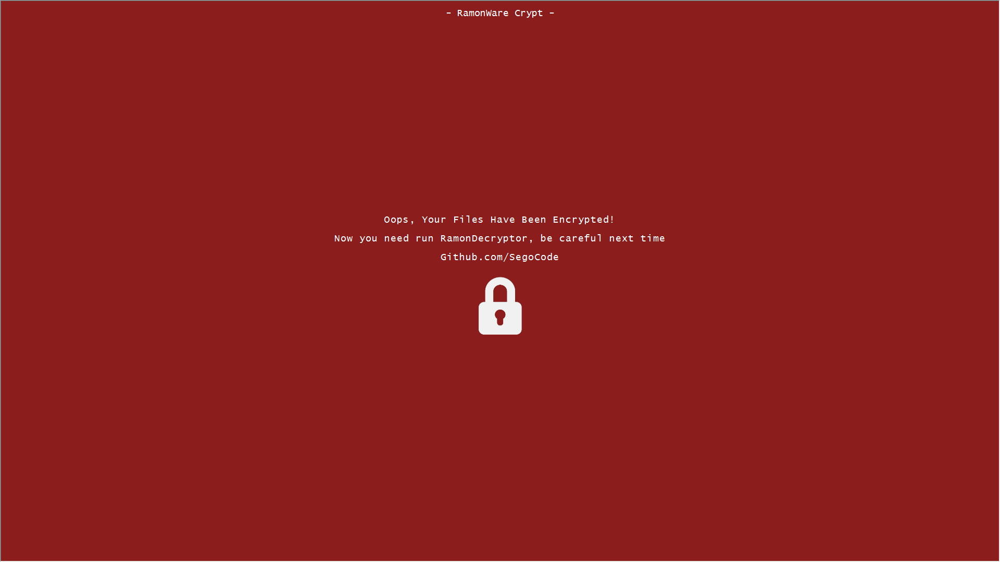

# {reponame}

<h3 align="center"></h3>

<p align="center">
  <a href="#about">About</a> •
  <a href="#features">Features</a> •
  <a href="#quick-start--information">Quick Start & Information</a> •
  <a href="#download">Download</a> 
</p>

## About
[](https://github.com/{username}/{reponame})
[](https://github.com/{username}/{reponame})
[](https://github.com/{username}/{reponame}/graphs/commit-activity)
[](https://github.com/{username}/{reponame}/blob/main/LICENSE)
[](https://github.com/SegoCode/SegoCode/discussions/2)


RamonWare is a Windows batch prototype of a ransomware incident. Shows a fullscreen lock screen (HTA). Encryption stays commented. The script does not encrypt or delete files unless you uncomment the PowerShell AES block. https://www.trendmicro.com/vinfo/us/threat-encyclopedia/malware/trojan.bat.ramonware.thjoebc

## Features

- Lock screen: opens a fullscreen HTA with a WannaCry-style note after the scan.

- Single file: `code/Ramonware.bat` holds the scan and the HTML. No extra install.

## Quick Start & Information

```shell
git clone https://github.com/{username}/{reponame}
cd {reponame}/code
Ramonware.bat
```

> [!CAUTION]
> The scan starts at `%homedrive%\` and walks every folder.
> Uncommenting the PowerShell AES lines and `del` encrypts the file and removes the original.

## Download

https://raw.githubusercontent.com/SegoCode/Ramonware/refs/heads/master/code/Ramonware.bat

---
<p align="center"><a href="https://github.com/{username}/{reponame}/graphs/contributors">
  
</a></p>
